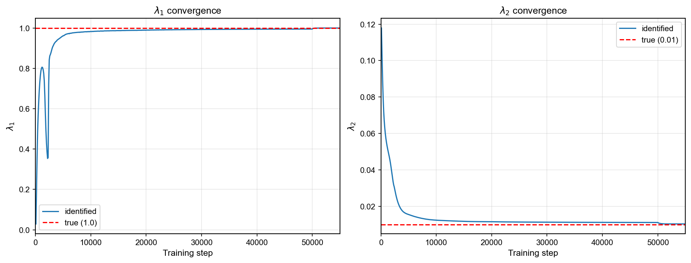
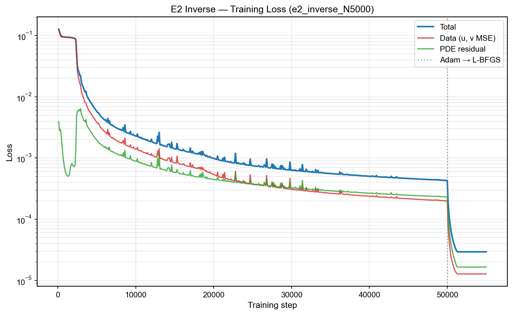
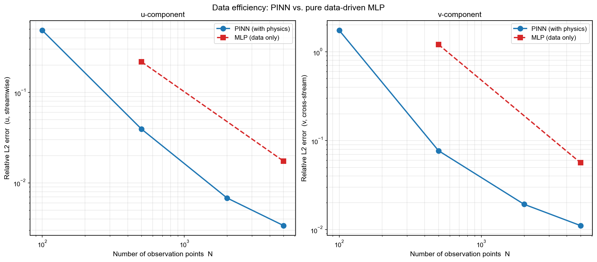

# PINN for 2D Cylinder Wake Flow at Re = 100

使用 Physics-Informed Neural Networks（PINN）求解不可壓縮 Navier-Stokes 方程，
**復現並延伸** Raissi et al. (2019) 的 2D 圓柱繞流結果。

本專案以 **PyTorch 從零實作**，展示 PINN不同設定下的 CFD 求解能力，並透過自主延伸實驗探討 PINN 相對於純資料驅動模型
的優勢。

---

## 視覺化結果

<p align="center">
  
  <br>
  <em>Inverse problem：5000 個稀疏 (u, v) 觀測 → 完整 (u, v, p) 重建（壓力場無觀測）</em>
</p>

<p align="center">
  
  <br>
  <em>Vorticity 對比：Forward 與 Inverse 兩種設定的精度差異（統一 colorbar）</em>
</p>


## 三個實驗的技術設計

### 實驗 1：Inverse Problem（復現論文）

**設定**：從 5000 個稀疏 (x, y, t, u, v) 觀測點，同時：
- 重建完整 (u, v, p) 流場（含未觀測的壓力場）
- 識別 NS 方程的物理參數 λ₁（convective）, λ₂（viscous）

**關鍵技巧**：觀測點同時作為 PDE collocation 點，data loss 與 PDE residual loss
在同一批點上「協作」，提供最強的 λ 識別訊號。

**結果**：

| 指標 | 本專案 | Raissi 2019 |
|:-----|:------:|:----------:|
| λ₁ 相對誤差 | **0.054%** | 0.078% |
| λ₂ 相對誤差 | **3.17%** | 4.67% |

<p align="center">
  
  <br>
  <em>λ₁, λ₂ 收斂曲線（含 Adam → L-BFGS 兩階段轉折）</em>
</p>
由上圖可以發現**λ₁** 從初始值快速上升至 ~0.8 後出現一次明顯回落（step ~1500–2500，最低 ~0.35），
  隨後單調收斂至真值 1.0，約在 step 10000 後完全穩定。
<p align="center">
  
  <br>
  <em>Loss曲線圖（含 Adam → L-BFGS 兩階段轉折）</em>
</p>
由λ₁, λ₂ 收斂曲線與Loss 曲線圖可以發現在 1500-2500，期間 PDE residual（綠線）
  出現一次顯著的隆起，與 λ₁ 的劇烈震盪在
  時間上完全對應。這代表 PINN 網路正在探索梯度的新方向—— 此時 λ₁ 還沒鎖定正確的對流項係數，PDE residual 自然無法降低；當 λ₁ 開始穩定靠近 1.0 時，PDE residual
  才隨之下降，total loss 也同步進入下降期。
<p align="center">
  
  <br>
  <em>Inverse problem：用 5000 筆資料重建整個時空場</em>
</p>
---

### 實驗 2：Data Efficiency Study（自主延伸 #1）

**問題**：當實驗資料變少時，PINN 跟純資料驅動模型的差距如何變化？

**設定**：
- PINN：N = 100, 500, 2000, 5000 觀測點（共 4 個 run）
- MLP（baseline）：N = 500, 5000 觀測點（共 2 個 run）

**核心結論**：**PINN 在所有資料量下皆優於 MLP，資料越少優勢越大**。

<p align="center">
  
  <br>
  <em>觀測點數量 N 對 relative L2 誤差的影響（u, v 兩分量）</em>
</p>


---

### 實驗 3：Forward Problem（自主延伸 #2）

**問題**：在無內部觀測的情境下，PINN 能否僅用邊界條件 + 物理方程求解整個
流場？此設定更接近傳統 CFD 的應用場景。

**設定**：
| 監督類型 | 取樣位置 | 取樣時間 | 樣本數 |
|:-------|:--------|:--------|:-----:|
| IC（初始條件）| 整個矩形域內部 | t = 0 | 5,000 |
| BC（邊界條件）| 矩形 4 邊 | 50 個時間切片 | 20,000 |
| PDE residual | LHS over spacetime box | 全時間軸 | 20,000 |

**結果**：

| 指標 | 結果 |
|:-----|:----:|
| L2(u) | **1.01%** |
| L2(v) | **3.90%** |


<p align="center">
  
  <br>
  <em>Forward problem：僅用邊界資訊重建整個時空場</em>
</p>

## 實驗細節

| 項目 | 值 |
|:-----|:---|
| Framework | PyTorch（純，無 DeepXDE/Modulus）|
| 模型 | 8 層 × 20 神經元，tanh 激活，Xavier 初始化 |
| 輸出 | Stream function ψ + pressure p（連續方程自動滿足）|
| 訓練 | Adam (50,000) → L-BFGS (5,000) 兩階段 |
| Reynolds | 100（Raissi 提供的 cylinder_nektar_wake.mat）|
| 硬體 | NVIDIA RTX 3060|
| Python / CUDA | 3.10 / 12.8 |

---

## Quick Start

### 1. 環境設置

```bash
pip install -r requirements.txt
```

### 2. 資料

下載 Raissi 提供的 `cylinder_nektar_wake.mat` 放到 `data/`：
[原始資料連結](https://github.com/maziarraissi/PINNs/tree/master/main/Data)

### 3. 執行三個實驗

```bash
# 實驗 1：Inverse problem
python scripts/train.py --config configs/e2_inverse_N5000.yaml

# 實驗 2：Data efficiency（多個 run）
bash scripts/run_e3.sh

# 實驗 3：Forward problem
python scripts/train.py --config configs/e1_ablation_A_baseline.yaml
```

### 4. 產生視覺化

```bash
# 所有靜態圖（loss 曲線、λ 收斂、E3 對比等）
python scripts/make_figures.py
python scripts/make_loss_figures.py

# 動畫（需 ffmpeg；fallback 到 gif）
python scripts/make_e2_comparison_animation.py    # Inverse 動畫
python scripts/make_e1_comparison_animation.py    # Forward 動畫
python scripts/make_vorticity_comparison.py       # E1 vs E2 vorticity 對比
```

> **說明**：repo 內部的 config 與 results 仍使用 e1/e2/e3 命名（反映實驗的
> 開發歷史），上方表格的「實驗 1/2/3」是按 narrative 順序組織的對外編號。
> 對應關係：
> - 實驗 1（Inverse）↔ `e2_inverse_N5000`
> - 實驗 2（Data Efficiency）↔ `e3*`
> - 實驗 3（Forward）↔ `e1_ablation_A_baseline`

---

## 專案結構

```
pinn-cylinder-wake/
├── configs/         # YAML 訓練設定
├── data/            # Raissi cylinder_nektar_wake.mat
├── src/
│   ├── data/        # 資料載入與採樣（LHS）
│   ├── models/      # PINN（ψ-p 輸出）+ MLP（baseline）
│   ├── physics/     # NS residual + 自動微分工具
│   ├── training/    # Adam / L-BFGS trainer + losses
│   ├── evaluation/  # Relative L2 + 各種 metrics
│   └── visualization/  # plots / animations / styles
├── scripts/         # 入口腳本
├── results/         # 訓練輸出（checkpoints / metrics / history）
├── figures/         # 產出的圖與動畫
└── docs/            # 設計文件、實驗計畫、troubleshooting
```
